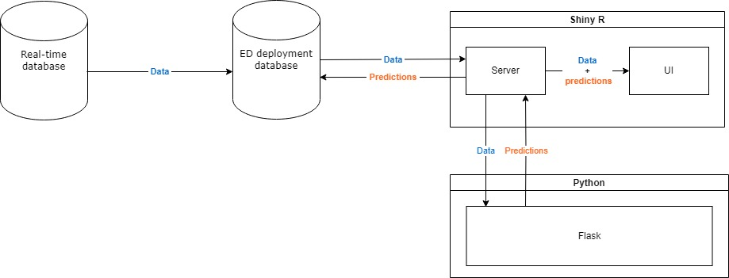

# Emergency Department Admission prediction
This repository contains the code for the graduation project titled: "Admission-Prediction on the Emergency Department through Multi-Modal Machine Learning". 
The abstract of this project can be found in the section below. The abstract for this project is provided in the following section. Please note that due to the development environment of the code being the private GitLab ZGT environment, the commit history is not available in the commit tab of this repository. However, the complete Git commit history is documented in the file named `git_commit_history.txt`.

## Abstract
The Emergency Department (ED) plays a vital role in healthcare, but global crowding issues compromises efficiency, impacting healthcare quality. Accurately predicting hospital admission for patients on the ED is crucial for optimizing resource allocation and improving patient outcomes. By leveraging machine learning (ML) and incorporation of multiple data stream, the aim of this study was to develop a predictive model for hospital admission on the ED. To achieve this, a dataset was utilized comprising 217,584 ED spanning from 2015 to 2022. This dataset contained general ED, vital sign, and lab data. Using this data, a ML model for every 10-minute interval after arrival was developed, taking the temporal nature of the dataset into account. The ML model selection process involved comparing various models using different metrics. The extreme gradient boosting classifier outperformed all other models across most of the tested metrics. The extreme gradient boosting models were tested on unseen data from 2022, achieving a mean Area Under the Curve (AUC) of 0.88 (0.851–0.893). Feature importance analysis highlighted importance gain of vital sign and lab results over time. Using the developed ML models an application capable of achieving and visualizing real-time predictions and patient was successfully developed.

## Project Structure
The repository is organized by the steps taken during the research:  
* **1_DataExtraction**  
 This section includes SQL files utilized for extracting raw data from the relevant databases.
* **2_EDA**  
 In the EDA phase, an in-depth exploration of various datasets is conducted. This encompasses data related to emergency department visits, vital signs, laboratory results, and radiology reports. The goal is to gain insights into the characteristics of the data, identify patterns, and inform subsequent preprocessing steps.
* **3_PreProcessing**  
 Scripts within this section focus on the preprocessing of raw data. The preprocessing steps may include encoding features, normalizing features, and addressing any data quality issues. This stage ensures that the data is well-prepared for input into the machine learning models.
* **4_MachineLearning**  
 This section contains the machine learning aspect. It involves the development, training, and evaluation of predictive models using the preprocessed data. Various algorithms and techniques are explored to create a robust model capable of accurately predicting emergency department admissions. The file `TIME_ML.ipynb' is the main file where the models were developed. The other two files were short test files.  
* **5_Deployment**:  
The deployment phase is divided into three components, each serving a specific purpose. An overview of the interaction between these component is visualised below:
    1. _**SSIS package**_: Used for data transfer between the databases
    2. _**Shiny**_: Used for extracting the data from the database and displaying the results. This component interfaces with a Flask API to obtain predictions generated by the machine learning models.
    3. _**Flask**_: Responsible for preprocessing, feature encoding, and applying the developed machine learning models to make predictions, delivering real-time predictions.

## Dependencies
### Python
For this project `Python v3.6.9` was used with the following packages

| Package         | Version  |
|-----------------|----------|
| Flask           | `2.0.3`  |
| joblib          | `1.1.1`  |
| nltk            | `3.6.7`  |
| numpy           | `1.19.5` |
| pandas          | `1.1.5`  |
| PyYAML          | `6.0.1`  |
| scikit_learn    | `0.24.2` |
| workalendar     | `16.4.0` |
| xgboost         | `1.5.2`  |
| pandas          | `1.1.5`  |
| numpy           | `1.19.5` |
| matplotlib      | `3.3.4`  |
| seaborn         | `0.11.2` |
| tansformers     | `4.18.0` |
| datasets        | `2.4.0`  |
| joblib          | `1.1.1`  |
| scikit-optimize | `0.9.0`  |

### R
For this project `R v4.0.2` was used, and the following dependencies were used  

| Package         | Version  |
|-----------------|----------|
| Flask           | `2.0.3`  |
| httr            | `1.4.7`  |
| yaml            | `2.2.1`  |
| jsonlite        | `1.7.0`  |
| DT              | `0.30`   |
| plotly          | `4.10.3` |
| odbc            | `1.2.3`  |
| shinythemes     | `1.2.0`  |
| shiny           | `1.6.0`  |
| shinyjs         | `2.1.0`  |
| dplyr           | `1.0.7`  |
| data.table      | `1.13.0` |
| htmltools       | `0.5.4`  |

## Usage
* First, the data can be extracted by using the SQL scripts found in the **1_DataExtraction** repository.  
* The exploratory data analysis can be reproduced by rerunning the jupyter notebooks in **2_EDA**. The paths to the data files need to be changed in the `2_EDA/eda_config.yaml` file.  
* The data can be processed using the scripts found in **3_PreProcessing**. To run the scripts use the following command:  
`python3 script.py datafile.csv`  
where `script.py` is one of the scripts and `datafile.csv` is a data file in csv format.  
* The processed data can then be used for machine learning. To obtain the trained machine learning models or do a re-run of the training and model selection process, run the jupyter notebooks found in **4_MachineLearning**.
* Finally, the application can be developed. The flask and shiny application can be build using the Dockerfile in its corresponding directory. If the structure of the directory is changed, change this in the corresponding `config.yaml` file. Specifically, the `config.yaml` file in `ed_admission_prediction/5_Deployment/shiny/components/` information for the database connection need to be filled. To build the Dockerfile use the following command:
`sudo docker build -t image_name path/to/Dockerfile`
where image_name is the name you want to give to your docker image.

## Contact
For any question please contact Job Maathuis at j.maathuis@st.hanze.nl

